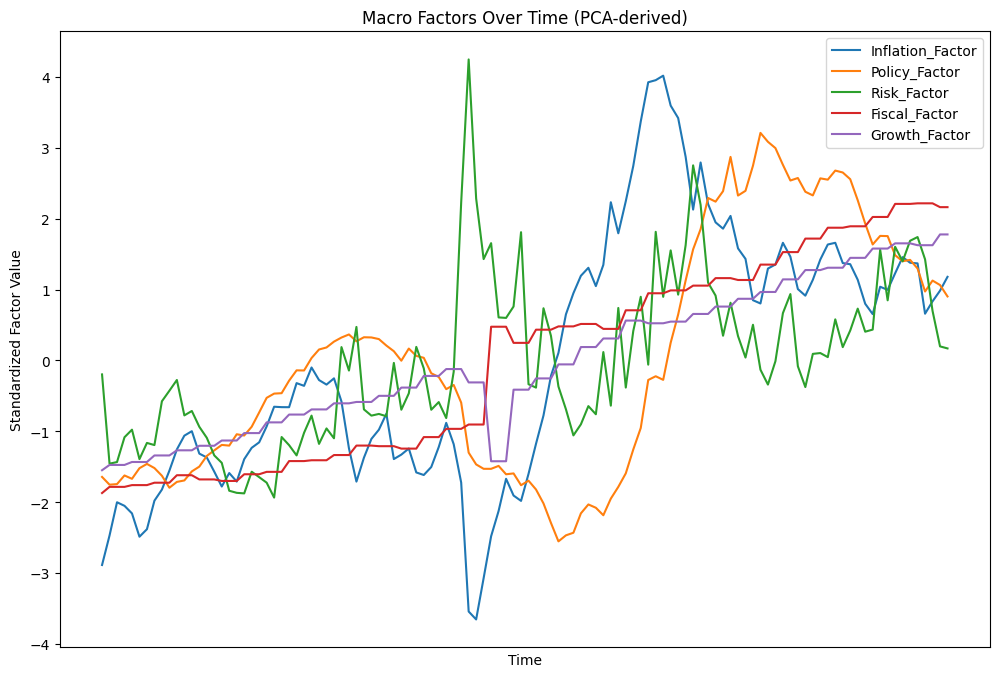
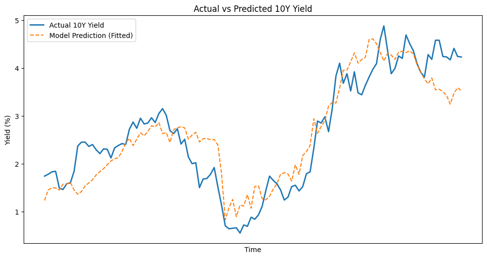

# The Macroeconomic Determinants of the 10-Year Treasury Yield

This repository contains a quantitative analysis of the long-term interest rate structure of the United States, focusing on the 10-year Treasury yield.  
The objective is to identify and quantify the principal macroeconomic forces that explain the historical variation in the yield from 2016 to 2025.

---

## 1. Overview

The model decomposes the 10-year yield into a set of latent macroeconomic factors extracted through **Principal Component Analysis (PCA)** applied to grouped economic indicators.  
Five thematic factor categories are defined:

| Category | Variables | Interpretation |
|-----------|------------|----------------|
| Inflation | CPI, CPI_YoY, Inflation Expectations, Oil Prices | Price level and inflationary pressure |
| Policy | 2Y Yield, Federal Funds Rate, Yield Curve Slope | Monetary policy stance |
| Risk | VIX, USD Index | Market volatility and risk aversion |
| Fiscal | Federal Debt, Debt-to-GDP Ratio | Fiscal sustainability and leverage |
| Growth | Real GDP (SAAR) | Real economic activity |

Each factor represents the first principal component of its corresponding variable group.  
The factors are orthogonal by construction and standardized to mean zero and unit variance.

---

## 2. Methodology

1. **Data Collection**
   Data were gathered using the FRED (https://www.stlouisfed.org) API. You can find a script of the data gathering code or the final .csv file in the data folder.

3. **Data Standardization**  
   All variables are standardized to zero mean and unit variance.

4. **Principal Component Extraction**  
   For each thematic group \( G_i \) with variables \( x_{i1}, x_{i2}, \dots, x_{in} \), PCA is applied to obtain the first component:
   \[
   F_i = w_{i1}x_{i1} + w_{i2}x_{i2} + \dots + w_{in}x_{in}
   \]
   where \( w_{ij} \) are loadings maximizing \( \text{Var}(F_i) \).

5. **Regression Framework**  
   The 10-year yield \( Y_t \) is modeled as:
   \[
   Y_t = \beta_0 + \beta_1 F^{(Infl)}_t + \beta_2 F^{(Pol)}_t + \beta_3 F^{(Risk)}_t + \beta_4 F^{(Fiscal)}_t + \beta_5 F^{(Growth)}_t + \epsilon_t
   \]
   Estimation is performed via **Ordinary Least Squares (OLS)**.

---

## 3. Results

\[
R^2 = 0.816, \quad \text{Adj. } R^2 = 0.807
\]

| Factor | Coefficient | t-Statistic | p-Value | Interpretation |
|---------|--------------|-------------|----------|----------------|
| Intercept | 2.628 | 54.41 | 0.000 | Baseline yield level |
| Inflation | 0.092 | 2.16 | 0.033 | Positive sensitivity to inflationary pressure |
| Policy | 0.527 | 11.86 | 0.000 | Dominant driver: policy stance shifts |
| Risk | -0.179 | -3.30 | 0.001 | Negative relationship (flight-to-safety effect) |
| Fiscal | -0.059 | -0.60 | 0.551 | Insignificant at monthly frequency |
| Growth | 0.265 | 1.70 | 0.091 | Weakly positive correlation |

The model explains approximately 81% of the yield’s historical variation.  
Residual variation corresponds to market noise, liquidity effects, and unobserved global drivers.

---

## 4. Interpretation

The regression decomposition aligns with theoretical term structure frameworks.  
The **Policy Factor** dominates yield variation, consistent with the expectations hypothesis.  
The **Inflation** and **Risk** factors contribute meaningfully, capturing inflation compensation and flight-to-safety dynamics.  
Fiscal variables evolve too slowly to exhibit statistical significance at a monthly resolution.

---

## 5. Theoretical Context

This framework is conceptually related to the **Nelson–Siegel** (1987) and **Adrian–Crump–Moench (ACM)** (2013) term structure models, but is implemented using a reduced-form, macro–factor representation.  
The model captures both expectations of future short-term rates and the term premium through observable macroeconomic dimensions.

---

## 6. Implementation

- Language: Python  
- Libraries: `pandas`, `numpy`, `scikit-learn`, `statsmodels`, `matplotlib`, `plotly`  
- Data frequency: Monthly (2016–2025)  
- Dependent variable: 10-Year Treasury Constant Maturity Rate (FRED: DGS10)

---

## 7. Visualization

The repository includes:
- Time series of standardized macro factors  
- Actual vs. model-fitted 10Y yield  
- Factor contribution decomposition  
- 3D PCA visualization of macro variable space  

---

## 8. References

- Diebold, F. X., & Li, C. (2006). *Forecasting the Term Structure of Government Bond Yields.*  
- Adrian, T., Crump, R. K., & Moench, E. (2013). *Pricing the Term Structure with Linear Regressions.*  
- Nelson, C. R., & Siegel, A. F. (1987). *Parsimonious Modeling of Yield Curves.*

---

## 9. Citation

If this work is referenced, please cite as:

> Papakyriakopoulos, Dimitrios. *The Macroeconomic Determinants of the 10-Year Treasury Yield.* (2025). GitHub Repository.

---

## Appendix: Figures

### Figure 1. Evolution of Macro Factors (2016–2025)

The standardized PCA-derived factors (Inflation, Policy, Risk, Fiscal, Growth) display distinct temporal dynamics.  
Notably, the Policy Factor rises sharply post-2021, coinciding with the U.S. monetary tightening cycle.

---

### Figure 2. Actual vs. Model-Fitted 10-Year Yield

The model’s fitted series tracks the actual 10-year yield with an adjusted \( R^2 = 0.807 \).  
Residual deviations correspond to market shocks and structural breaks.
